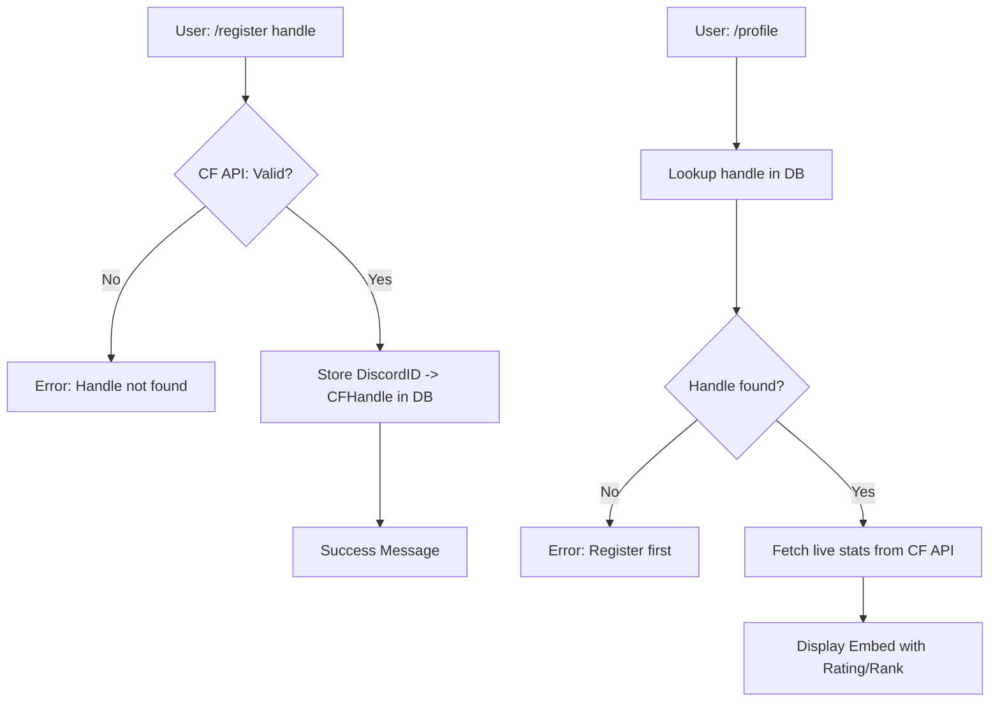
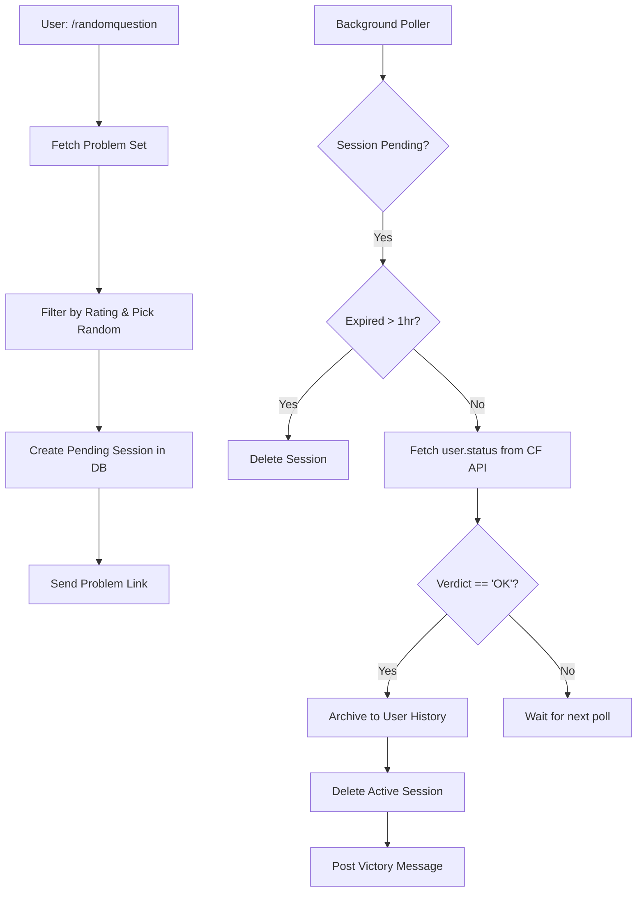
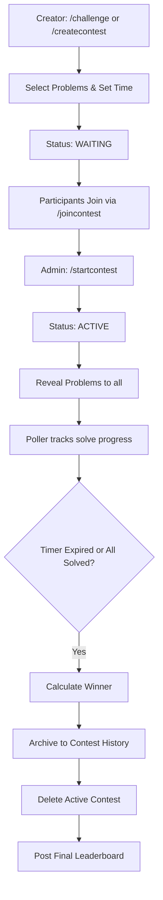

# Design Document: Codeforces Discord Bot

## 1. Architecture Overview
The bot follows an asynchronous event-driven architecture using `discord.py` and `motor` (async MongoDB). It acts as a bridge between the Discord interface and the public Codeforces API.

### Core Philosophy: "ID-Only Storage"
To remain within the MongoDB Atlas Free Tier limits, the bot never stores static data (problem statements, user ratings, etc.) that can be fetched from the API. It only stores **Identifiers (IDs)** and **Timestamps**.

## 2. System Flow Diagrams

### A. User Registration & Profile Flow

### B. Practice & Submission Tracking Flow

### C. Duel & Contest Lifecycle

## 3. Data Models (MongoDB Collections)

### `users`
Stores the link between Discord and Codeforces.
- `discord_id` (Unique Index): The Discord Snowflake ID.
- `cf_handle`: The verified Codeforces handle.
- `discord_name`: Display name for logging.

### `active_sessions` (Ephemeral)
Tracks individual practice problems.
- `user_id`: Discord ID.
- `problem_id`: Format `contestId-index` (e.g., "1234-A").
- `start_time`: UTC timestamp.
- `status`: `pending` | `completed` | `expired` | `skipped`.
- `channel_id`: Where to post the success message.

### `contests` (Ephemeral)
Stores the blueprint for Duels and Group Contests.
- `contest_id`: Unique identifier.
- `creator_id`: Discord ID of the admin.
- `type`: `duel` | `group`.
- `problems`: Array of `problem_id` (e.g., `["123-A", "124-B"]`).
- `duration`: Duration in minutes.
- `start_time`: UTC timestamp (set only when started).
- `status`: `waiting` | `active` | `finished`.
- `participants`: Array of objects `{ user_id, solved_count, time_taken }`.

### `user_history` (Persistent)
The "Trophy Room" for solved problems.
- `user_id`: Discord ID.
- `problem_id`: Codeforces ID.
- `solved_at`: UTC timestamp.
- `attempts`: Number of submissions.
- `time_taken`: Seconds from assignment to solve.

## 4. Infrastructure & Scaling
- **API Rate Limiting**: The bot uses a single `aiohttp.ClientSession` and minimizes requests by only polling active users.
- **DB Optimization**: Uses `upsert` for user sessions to prevent duplicate rows.
- **Memory**: No heavy state is kept in RAM; the MongoDB Atlas cluster serves as the primary state machine.
