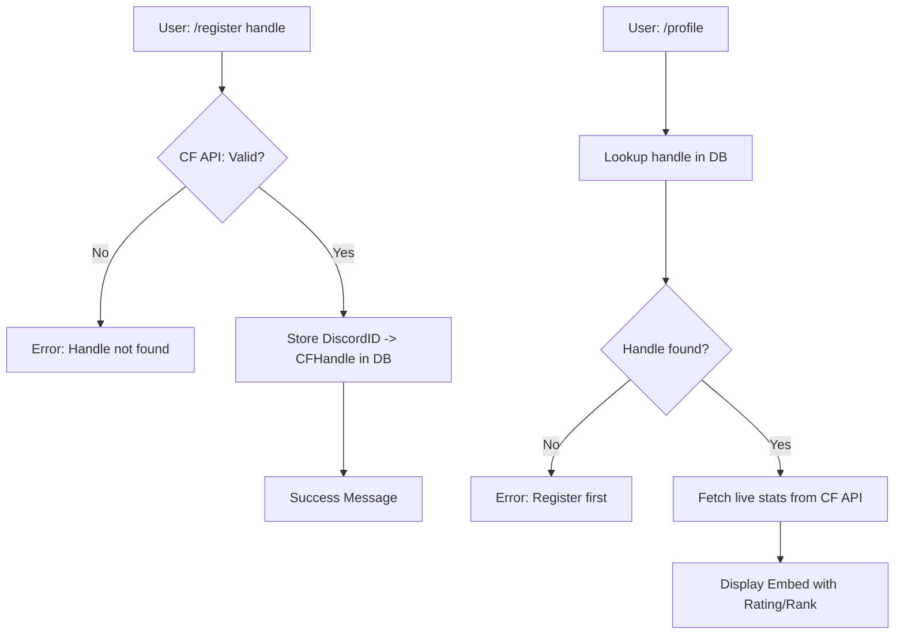
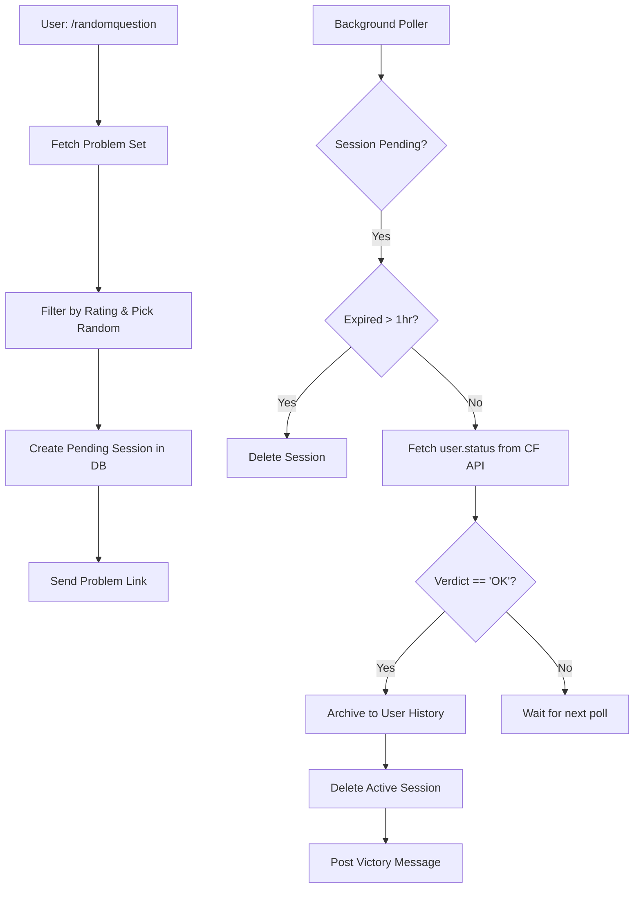
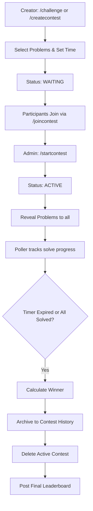

# Codeforces Discord Bot

A competitive programming bot that integrates Codeforces API with Discord to facilitate practice, 1v1 Duels, and Group Contests.

## 🚀 Features
- **User Registration**: Link Discord accounts to Codeforces handles.
- **Profile Tracking**: Live fetching of CF ratings and ranks.
- **Random Practice**: Get a random problem within a rating range and have the bot track your submission status automatically.
- **1v1 Duels**: Challenge a friend to a timed competition with automatically selected problems.
- **Group Contests**: Create a contest, invite participants, and start it manually as an admin.
- **Live Polling**: Background tracking of submissions to announce wins in real-time.
- **Submission History**: Lean storage of solved problems.

## 🛠️ System Flow

### Registration & Profile


### Practice Tracking


### Duels & Contests


## 📦 Installation
1. Clone the repository.
2. Install Python 3.11+.
3. Create a virtual environment:
   ```bash
   python -m venv venv
   source venv/bin/activate # Windows: venv\Scripts\activate
   ```
4. Install dependencies:
   ```bash
   pip install -r requirements.txt
   ```
5. Configure `.env` with `DISCORD_TOKEN` and `MONGO_URI`.
6. Run the bot:
   ```bash
   python bot.py
   ```
